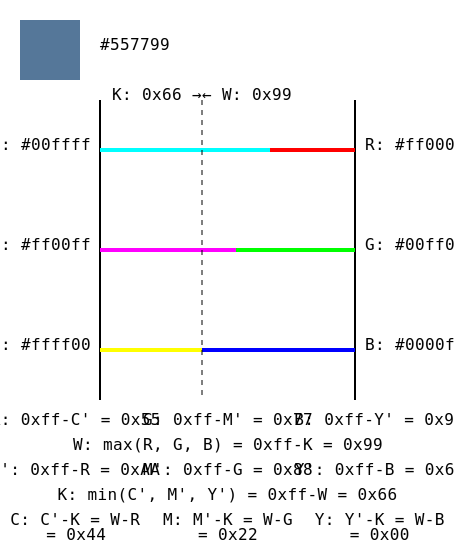

# cmyk4devs

## A visual representation of CMYK vs RGB



## The rant section

For some reason most examples of converting RGB to CMYK tesnds to add re-scaling from 0..255 to 0..1 sprinkled in thoughout the conversion equation iself:

`K=1-max(R/255,G/255,B/255)`

This just adds noise and confusion.

Some don't even minimize their equations and waste performance/complexity:

`C=(1-G/255-K)/(1-K)`

The result may be correct for some representation, but is utterly unhelpful when converting RGB24 to CMYK32 or just trying to read it the first time.
Either keep the explanation full-on math and represent your RGB in 0..1 too, or stay in bytes. Don't mix and match.

The one integer algorithm i found also wasted operations:

```
C' = 255 – R
M' = 255 – G
Y' = 255 – B

K = min(C',M',Y')

C = C' – K
M = M' – K
Y = Y' - K
// 6 subtractions and one 3-way minimum
```

The former may be slightly more intuitive, but this is how it is done:

```
W = max(R,G,B)

C = W - R
M = W - G
Y = W - B

K = 255 - W
// 4 subtractions and a 3-way maxumum
```
