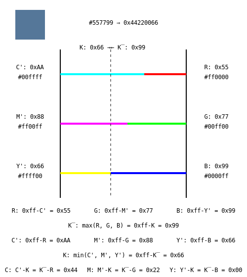

# cmyk4devs

I found most CMYK explanations and conversion algorithms unintuitive and over-complicated, so i made my own. Targeted at people who think in computer terms.

## A visual representation of CMYK vs RGB



Note: W here has no relation to RGBW, it is just the opposite of K since it is conveinient to calculate with.

## But what does CMYK do?

CMYK replaces the part of the total color that would cancel out into black with actual black.
This is the native format when printing (effectively subtracting color from white paper) and helps with waste/cost and quality.

## The rant section

For some reason most examples of converting RGB to CMYK tends to add re-scaling from 0..255 to 0..1 sprinkled in throughout the conversion equation/algorithm itself:

`K=1-max(R/255,G/255,B/255)`

This just adds noise and confusion.

Some don't even minimize their equations and waste performance/complexity:

`C=(1-R/255-K)/(1-K)`

The result may be correct for some representation, but is utterly unhelpful when converting RGB24 to CMYK32 or just trying to read it the first time.
Either keep the explanation full-on math and represent your RGB in 0..1 too, or stay in bytes. Don't mix and match.

The one integer algorithm i found also wasted operations:

```
C' = 255 – R
M' = 255 – G
Y' = 255 – B

K = min(C',M',Y')

C = C' – K
M = M' – K
Y = Y' - K
// 6 subtractions and one 3-way minimum
```

The former may be slightly more intuitive, but this is how it is done:

```
W = max(R,G,B)

C = W - R
M = W - G
Y = W - B

K = 255 - W
// 4 subtractions and a 3-way maximum
```
